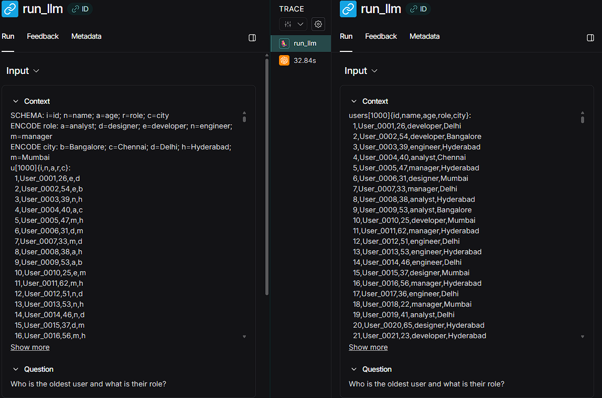
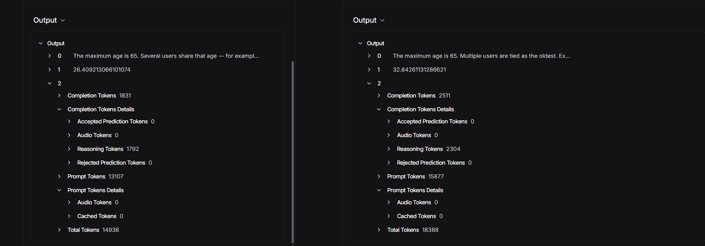
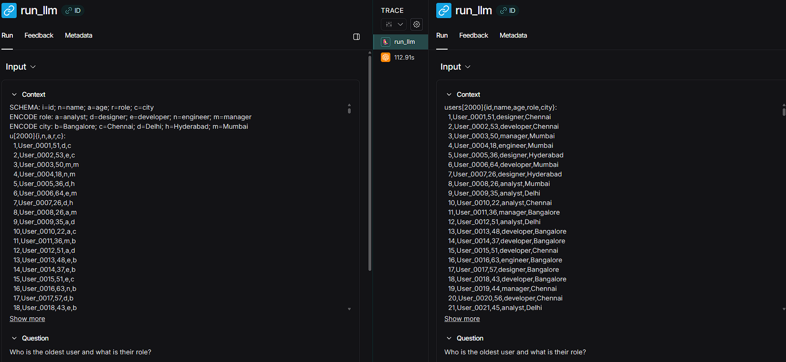
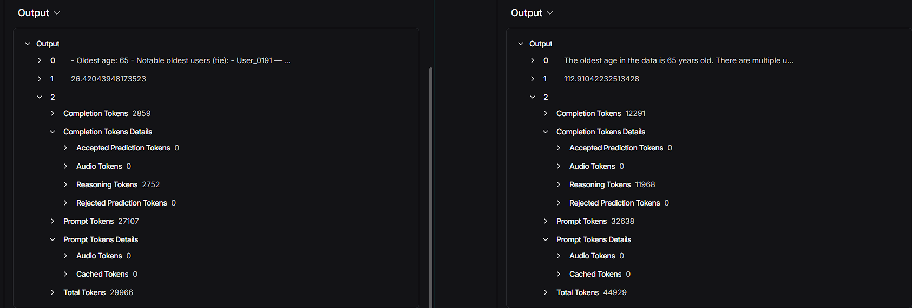

# **SONIC - Schema Optimized Notation for Intelligent Compression**

SONIC is an experimental ultra-compact data representation format designed to reduce prompt tokens dramatically when sending large structured datasets into Large Language Models.
It is the next conceptual evolution after TOON and aims to be a practical successor for token-efficient LLM computing.

SONIC compresses both structure and semantics using deterministic schema shorthand, column encoding, and predictable formatting.
The result is smaller prompts, lower cost, and higher context-window availability without losing meaning.

---

# **1. Abstract**

Language Models waste a large number of tokens on structural overhead rather than actual information.
JSON is readable but extremely verbose. Even TOON, although lighter, still repeats long field names and consumes space.

SONIC collapses all repeated structure using a deterministic schema mapping with one-letter aliases, encoded categorical values, and a rigid minimal syntax.
This creates a representation that is lossless, reversible, and interpreted perfectly by modern LLMs.

Experiments across GPT-5 Mini and GPT-5 Nano with datasets of 1000 and 2000 rows show consistent savings in both prompt and total tokens.

---

# **2. Motivation**

When working with LLM agents or high volume inference systems, structured data often dominates prompt space.
This leads to higher cost, slower inference, and quick exhaustion of context limits.

We asked a simple question:

**How small can a structured dataset be while still being perfectly reasoned about by an LLM**

SONIC is built around that answer.

---

# **3. JSON vs TOON vs SONIC**

### JSON

Verbose, key-heavy, large footprint.

```
{
  "users": [
    {"id":1, "name":"Alice", "age":30}
  ]
}
```

### TOON

Reduced syntax, but still repeats full field names.

```
users[1]{id,name,age}:
  1,Alice,30
```

### SONIC

Deterministic schema + encoded categorical values + minimal notation.

```
SCHEMA: i=id; n=name; a=age

u[1]{i,n,a}:
  1,Alice,30
```

This minimal form is still fully reversible.

---

# **4. SONIC Specification (v1)**

### Schema Block

The top of every SONIC payload.

```
SCHEMA: i=id; n=name; a=age; r=role; c=city
```

Rules

* first unused letter becomes alias
* collisions resolve with next available character
* stable ordering
* human readable and reversible

### Header Block

Defines dataset shorthand, size, and column order.

```
u[1000]{i,n,a,r,c}:
```

### Body Block

Pure values, comma separated, no extra structure.

```
  1,User_0001,26,d,c
  2,User_0002,54,e,b
```

SONIC can also use categorical encodings for fields with repeating values such as role or city.

---

# **5. Benchmark Results**

All benchmarks were run using the same question
**Who is the oldest user and what is their role**

Two models were used

* GPT-5 Mini on 1000 rows
* GPT-5 Nano on 2000 rows

---

## **5.1 GPT-5 Mini — 1000 Rows**

### SONIC vs TOON Input Comparison

*1000 entries*



### SONIC vs TOON Token Usage

*1000 entries*



---

## **5.2 GPT-5 Nano — 2000 Rows**

### SONIC vs TOON Input Comparison

*2000 entries*



### SONIC vs TOON Token Usage

*2000 entries*



---

# **6. Token and Cost Summary**

Costs use standard 2025 pricing assumptions.

| Model      | Rows | Format | Total Tokens | Estimated Cost |
| ---------- | ---- | ------ | ------------ | -------------- |
| GPT-5 Mini | 1000 | JSON   | 36310        | 0.0130 USD     |
| GPT-5 Mini | 1000 | TOON   | 18388        | 0.0089 USD     |
| GPT-5 Mini | 1000 | SONIC  | 14938        | 0.0069 USD     |
|            |      |        |              |                |
| GPT-5 Nano | 2000 | JSON   | 76291        | 0.0063 USD     |
| GPT-5 Nano | 2000 | TOON   | 44929        | 0.0065 USD     |
| GPT-5 Nano | 2000 | SONIC  | 29966        | 0.0020 USD     |

---

# **7. Project Structure**

```
SONIC/
│
├── assets/
│   ├── gpt_5_mini_1000_entries.png
│   ├── gpt_5_mini_1000_results.png
│   ├── result_2000_entries.png
│   ├── result2_2000_entries.png
│
├── converters.py
├── data_creator.py
├── graph.py
├── main.py
├── utils.py
│
├── test_data.json
├── test_data_1000.json
├── test_data_2000.json
│
└── README.md
```

---

# **8. Future Work**

* SONIC v2 with semantic block compression
* Automatic reversible SONIC to JSON compiler
* Multi table support (relational SONIC)
* Chunked and streaming SONIC for massive datasets
* SONIC aware agents for long context tasks
* A formal RFC style specification

---

# **9. Author**

**Krish Batra**

Creator of SONIC

LLM Token Efficiency Researcher

---

# **10. License**

This repository is provided as an open research artifact.

You may use, extend, or adapt it with attribution.